# FbFTL-LoRA統合フレームワーク

## 通信効率とパーソナライゼーションを両立する連合型転移学習の相乗的フレームワーク：FbFTLとFedSA-LoRAの統合

---

## 1. 序論：現代の連合学習が直面する二つの課題

### 1.1 スケールと分散のジレンマ

近年、数十億パラメータを持つ事前学習済み言語モデル（PLM）や基盤モデルがAI分野で中心的な役割を担うようになりました。これらの強力なモデルを、プライバシーを保護しつつ分散データを用いて学習する連合学習（Federated Learning, FL）の枠組みに適用する試みが活発化しています。

しかし、この試みは二つの根源的な障害によって著しく妨げられています:

#### 第一の障害：通信ボトルネック
標準的なFLでは、モデルの全パラメータの更新情報をクライアントからサーバーへ送信する必要があります。大規模モデルの場合、この更新情報のサイズは膨大となり、**1回の学習プロセスでテラバイト級のデータ転送**が必要になることもあります。

特に、帯域幅が限られる無線通信、エッジデバイス、あるいはIoT環境において、このような巨大な通信コストは現実的な実装をほぼ不可能にします。5Gの標準的なアップリンク速度が50 Mb/s程度であることを考慮すると、この問題の深刻さは明らかです。

#### 第二の障害：異質性ペナルティ
FLの参加者である各クライアントが保有するデータは、その統計的性質が異なる非独立同分布（**non-IID**）であることが一般的です。このようなデータの異質性は、FedAvgのような標準的な集約アルゴリズムの性能を著しく低下させます。

各クライアントで学習されたモデルが異なる方向に発散し、サーバーで集約されたグローバルモデルの精度が劣化するという問題は、FL分野における長年の課題として認識されています。

### 1.2 ハイブリッドソリューションの提案

本レポートでは、上記二つの課題を系統的に解決するために設計された、**新たな多層的ソリューション**を提案します。

この手法は、以下の二つの技術を相乗的に組み合わせるものです：

- **Feature-based Federated Transfer Learning（FbFTL）**のアーキテクチャ設計
- **Federated Share-A Low-Rank Adaptation（FedSA-LoRA）**の洗練された非対称適応プロトコル

本レポートの主題は、このハイブリッドアプローチが、極めて異質なデータ環境下においても、堅牢でパーソナライズされた性能を提供すると同時に、前例のないレベルの通信効率を達成できることを論証することにあります。

> **重要**：この統合フレームワークは、大規模モデルの連合学習を、理論的な可能性から実用的な現実へと転換させる鍵となる技術として位置づけられます。

---## 2. 基礎となる二本の柱：FbFTLとFedSA-LoRAの分解

提案するハイブリッド手法の革新性を理解するためには、その構成要素であるFbFTLとFedSA-LoRAの技術的基盤を深く掘り下げる必要があります。

### 2.1 アーキテクチャの青写真：Feature-based Federated Transfer Learning (FbFTL)

FbFTLは、連合学習における通信コストを抜本的に削減するために考案されたアーキテクチャです。

#### 2.1.1 メカニズム

FbFTLの核心は、**モデル分割戦略**にあります。事前学習済みの深層ニューラルネットワーク（DNN）モデルを、二つのサブモデルに分割します。

```
全体モデル = 特徴抽出サブモデル + タスク特化サブモデル
            (fθ₁)              (fθ₂)
```

- **特徴抽出サブモデル (fθ₁)**
  - モデルの前半部分を構成
  - 入力データから高次元の特徴量を抽出する役割
  - 事前学習済みの重みをコピーし、学習中は完全に凍結

- **タスク特化サブモデル (fθ₂)**
  - モデルの後半部分（通常は全結合層など）を構成
  - 特定のタスク（例：分類）を実行
  - パラメータはランダムに初期化され、学習の対象となる

#### 2.1.2 通信パラダイム

このモデル分割により、通信パラダイムが劇的に変化します：

1. クライアントは、自身のローカルデータを用いて、凍結された特徴抽出サブモデル fθ₁ による順伝播を一度だけ実行
2. 中間出力である特徴ベクトル `z_{u,k} = fθ₁(x_{u,k})` を生成
3. この特徴ベクトル z_{u,k} と対応するラベル y_{u,k} をサーバーにアップロード

**最大の特徴**：
- 勾配計算とパラメータ更新を含む反復的な逆伝播プロセスが、クライアントから完全に切り離される
- すべてサーバー側で実行される
- クライアントは重み更新情報を一切送信する必要がない
- 一度特徴量をアップロードすれば、その後の学習プロセスには関与しない

#### 2.1.3 効率性の定量化

この通信パラダイムは、通信ペイロードの大幅な削減をもたらします：

| 手法 | 通信内容 | データ量 |
|------|----------|----------|
| 従来のFL | 反復ごとにモデル全体の勾配 | 膨大 |
| FbFTL | 各データサンプルに対して一度だけ特徴ベクトル | 比較的小さな特徴ベクトル |

> **成果**：総アップロードデータ量を最大で**5桁（10⁵分の1）削減**できる可能性

これは、通信効率における画期的な改善です。

#### 2.1.4 FbFTLの潜在的課題

しかし、この独創的なFbFTLのネイティブな実装には、新たな課題が内在します：

##### ❶ スケーラビリティのボトルネック
- 何百万ものクライアントがそれぞれ数千のデータポイントを持つシナリオを想定
- サーバーに集約される特徴データセットは膨大なサイズに
- サーバーは、この巨大なデータセットを保存・処理するためのストレージと計算能力を要求
- 新たなスケーラビリティのボトルネックとなる

##### ❷ プライバシーリスクの再燃
- 特徴ベクトル z は生データ x そのものではないが、依然として機密情報を含んでいる可能性
- これらを単一のサーバーに集約することは、連合学習が本来回避しようとしていた中央集権的なデータストアと単一障害点を再び作り出す
- プライバシーリスクを増大させる

> **重要な認識**：このFbFTLが内包する課題こそが、本レポートで提案するハイブリッド手法が解決するべき核心的な問題点となります。すなわち、FbFTLの卓越した通信効率を維持しつつ、タスク特化サブモデル fθ₂ の中央集権的な学習を、分散型かつプライバシーを保護する連合プロトコルに置き換えることが求められるのです。

### 2.2 非対称適応メカニズム：FedSA-LoRA

FedSA-LoRAは、パラメータ効率の良いファインチューニング（PEFT）手法であるLow-Rank Adaptation（LoRA）を連合学習環境に適用する際の課題に対処するために開発された、高度なプロトコルです。

#### 2.2.1 LoRAの基礎

LoRAは、大規模モデルのファインチューニングにおいて以下の仕組みで動作します：

```
W_new = W₀ + ΔW
ΔW = B × A
```

- 元の重み行列 **W₀** を凍結
- 更新量 **ΔW** を二つの低ランク行列 A と B の積（ΔW=BA）で近似
- A ∈ R^{r×d} と B ∈ R^{k×r}
- ランク r は元の行列の次元 k,d に比べて非常に小さい（r ≪ min(k,d)）
- 学習対象のパラメータ数を劇的に削減

#### 2.2.2 集約エラー問題

LoRAを単純にFLに適用すると、「**集約エラー**」と呼ばれる問題が発生します：

| 理想的な集約 | 実際の集約 |
|--------------|------------|
| `1/m ∑ᵢ₌₁ᵐ Bᵢ Aᵢ` | `(1/m ∑ᵢ₌₁ᵐ Bᵢ)(1/m ∑ᵢ₌₁ᵐ Aᵢ)` |

この乖離がモデルの性能を損なう原因となります。

#### 2.2.3 核心的発見：LoRA行列の非対称性

FedSA-LoRAの根幹をなすのは、**A 行列と B 行列が学習において異なる役割を担う**という「非対称性」の発見です。

**理論的分析（Lemma 1）によれば**：
- **A 行列**の最適解は入力データの分布に**依存しない**
- **B 行列**の最適解は入力データの分布（具体的には二次モーメント E）に**直接依存**

これは以下を示唆します：
- **A**：タスクに関する**普遍的・一般的**な知識を学習
- **B**：クライアントのデータに固有の**特異的・個別的**な知識を捉える役割

#### 経験的検証
Figure 2に示された実験結果では：
- 異なるクライアント間で学習された **A 行列のコサイン類似度**は一貫して**高い値**
- **B 行列の類似度**は**低く**、さらにデータの異質性（non-IIDの度合い）が高まるにつれて低下

> **結論**：A がクライアント間で共有可能な知識を学習し、B が各クライアントのデータ分布の独自性を反映するパーソナライズされた知識を学習していることの強力な証拠

#### 2.2.4 FedSA-LoRAプロトコル

この非対称性の発見に基づき、FedSA-LoRAは以下の洗練されたプロトコルを定義します：

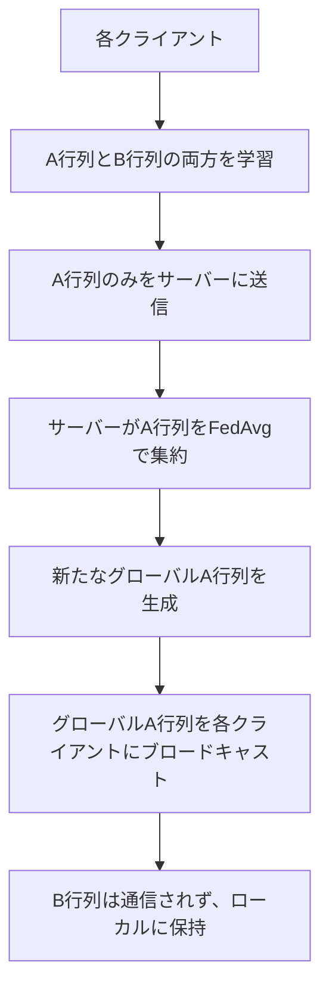

**プロトコルの利点**：
- ✅ 通信コストを**LoRAの半分**に削減
- ✅ 集約エラー問題を回避
- ✅ non-IIDデータに対する高い適応性を実現

---## 3. 提案ハイブリッド手法の統合とメカニズム

二つの基礎技術、FbFTLとFedSA-LoRAを統合することで、それぞれの長所を相乗的に活用し、短所を補完する、極めて効率的で堅牢な連合学習フレームワークが構築されます。

### 3.1 アーキテクチャの統合：段階的ワークフロー

提案するハイブリッドシステムにおける**1回の学習ラウンド**は、以下の明確なステップで進行します：

#### Phase 1: セットアップ
```
サーバー → 全クライアント
・凍結された特徴抽出サブモデル fθ₁（FbFTLの要素）
・初期のグローバルLoRA行列 A_global（タスク特化サブモデル fθ₂ 用）
```

#### Phase 2: クライアント側計算

**ステップ1: 特徴抽出**
```python
# FbFTLの原理
z = fθ₁(x)  # ローカルデータ(x,y)から特徴ベクトルを計算
```

**ステップ2: ローカル学習**
```python
# FedSA-LoRAによる学習（学習対象：LoRA行列 Aᵢ と Bᵢ のみ）
for epoch in local_epochs:
    loss = compute_loss(fθ₂(z, Aᵢ, Bᵢ), y)
    Aᵢ, Bᵢ = update_lora_matrices(loss)
```

#### Phase 3: 通信
```
クライアントᵢ → サーバー
・更新された Aᵢ 行列のみ
・特徴ベクトル z は送信されない
・Bᵢ 行列は送信されない
```

#### Phase 4: サーバー側集約
```python
# FedAvg集約
A_global = weighted_average([A₁, A₂, ..., Aₙ])
```

#### Phase 5: ブロードキャスト
```
サーバー → 次のラウンドの参加クライアント
・更新された A_global
```

### 3.2 通信コストの抜本的削減メカニズム

本手法の卓越した通信効率は、単一の技術によるものではなく、**複数の削減効果が連鎖的に作用する多段階通信効率エンジン**によって実現されます。

#### 🔄 削減ステージ1：アーキテクチャレベル（FTLによる削減）
```
P_total → P_head
```
- ベースライン：大規模モデルの完全ファインチューニング（通信コスト ∝ P_total）
- 本手法：巨大な特徴抽出サブモデル fθ₁ を凍結
- 通信対象をタスク特化サブモデル fθ₂ の更新情報に限定
- **第一段階の、最も大きな削減効果**

#### 🔄 削減ステージ2：アルゴリズムレベル（LoRAによる削減）
```
P_head → P_lora
```
- fθ₂ に対してLoRAを適用
- 学習対象パラメータ数をさらに削減
- P_lora ≪ P_head が成り立つ

#### 🔄 削減ステージ3：プロトコルレベル（FedSAによる削減）
```
P_lora → P_lora/2
```
- FedSA-LoRAプロトコルを適用
- 通信するパラメータをLoRA行列のうち A 行列のみに限定
- 1ラウンドあたりの通信ペイロードをさらに半分に削減

#### 📊 総合効果
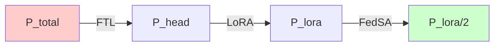

> **結論**：総通信ペイロードは、元のモデルサイズのごく一部の、さらにその一部にまで削減されます。この連鎖的な削減効果により、他のPEFT手法でさえコストが高すぎると考えられるような、極端にリソースが制約された環境での連合学習が現実的なものとなります。

### 3.3 non-IIDデータへの耐性メカニズム

本フレームワークがnon-IIDデータに対して高い堅牢性を示す理由は、**二つの異なる階層で機能するパーソナライゼーションアーキテクチャ**にあります。

#### 🏗️ 第1階層：共有特徴空間による暗黙的な正則化（FTLの利点）

```
多様で異質な生データ x → 共通で高品質な特徴空間 z
```

- 全クライアントで共有され、凍結された特徴抽出サブモデル fθ₁
- 異質な生データを**共通の「言語」**に変換
- 強力な正則化として機能
- 学習対象であるタスク特化サブモデルがクライアント間で過度に発散することを防ぐ

#### 🎯 第2階層：ローカルアダプタによる明示的なパーソナライゼーション（FedSA-LoRAの利点）

```
グローバルな知識（A_global） + ローカルな適応（Bᵢ） → パーソナライズされたモデル
```

- 各クライアントのローカル環境に保持される B 行列
- 決して集約されることのないパーソナライゼーションアダプタ
- サーバーから共有された一般的な知識（グローバル A 行列）を調整
- クライアント i 固有のローカルな特徴分布 P(z|clientᵢ) に合わせて最適化

#### ⚡ 相乗効果

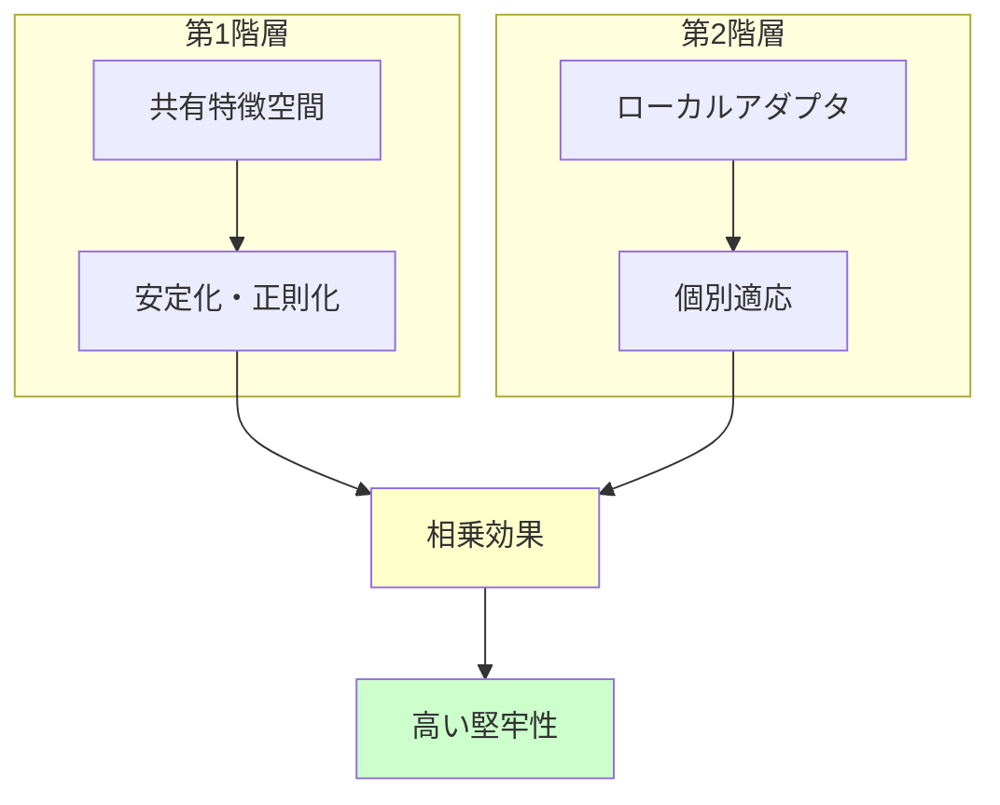

この二つの階層は相乗効果を生み出します：

1. **第1階層** → 第2階層のアダプタ（B 行列）の学習をより容易かつ効果的に
2. **普遍的な知識**（A_global）→ 安定した特徴空間上で学習されるためより堅牢に
3. **個別的な知識**（Bᵢ）→ 基本的な特徴を再学習する必要がなく、ローカルな偏差への適応に専念

> **重要な観察**：この相乗効果こそが、データの異質性が高まるにつれて他の手法との性能差が拡大する本手法の優位性の源泉です。

---## 4. 提案手法の優位性に関する包括的分析

本セクションでは、提供された研究データを基に、提案するハイブリッド手法が既存のアプローチに対して持つ多面的な優位性を詳細に分析します。

### 4.1 汎化とパーソナライゼーションのジレンマの解決

連合学習における中心的な課題は、以下の二つの目標間のトレードオフです：

#### 🌐 汎化性能
全クライアントで良好に機能する汎化性能の高いグローバルモデルを学習

#### 🎯 パーソナライゼーション
各クライアント固有のデータに対して高い性能を発揮するパーソナライズされたモデルを提供

本手法のアーキテクチャは、この二つの目標を明確に分離し、それぞれに特化したコンポーネントを割り当てることで、このジレンマを巧みに解決します。

#### 汎化コンポーネント
汎化性能の基盤を形成する要素：

```
汎化基盤 = 事前学習済み特徴抽出 + 連合学習による知識集約
          (凍結済み fθ₁)       (グローバルA行列)
```

1. **事前学習による広範な知識**：凍結済みの特徴抽出サブモデル fθ₁
2. **連合学習による知識集約**：全クライアントの知識を集約したグローバルな A 行列

これらはモデルが普遍的なパターンを学習することを保証します。

#### パーソナライゼーションコンポーネント

```
個別適応 = ローカル環境専用のアダプタ
          (各クライアントの B 行列)
```

- 各クライアントのローカル環境にのみ存在する B 行列
- 汎化コンポーネントが提供する共通の知識を調整
- クライアント固有のデータ分布に最適化

#### 🔑 **関心の分離**の利点

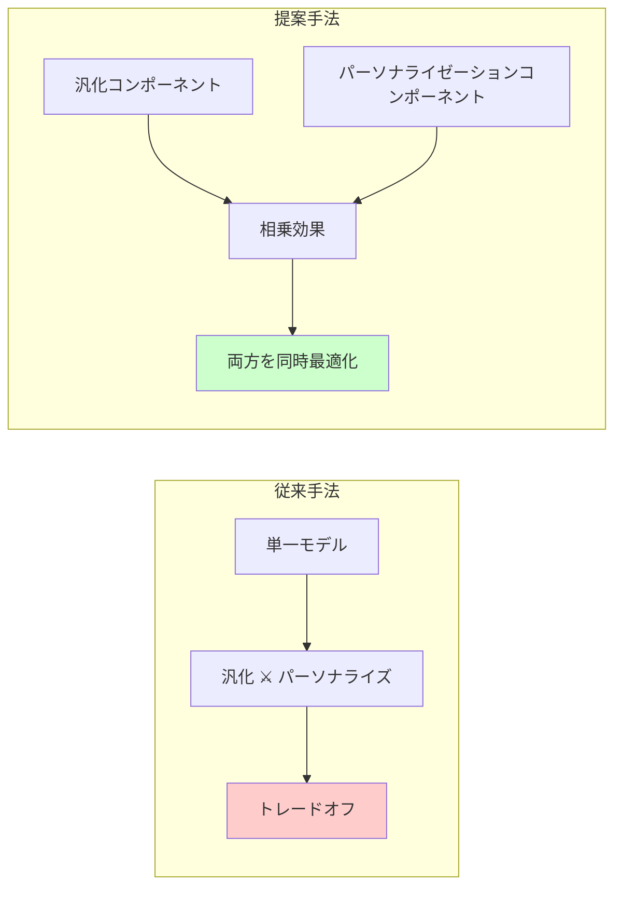

単一のモデル内でこれらの役割が絡み合っている従来の手法とは異なり、本アーキテクチャでは役割が明確に分離されています。この「関心の分離」により、汎化とパーソナライゼーションという二つの目的を、**互いに干渉することなく、より安定的かつ効果的に同時に最適化**することが可能になります。

### 4.2 システムレベルの効率性と目標精度到達時間

システム効率を評価する上で最も重要な指標：

> **目標精度に到達するまでの総コスト（または総時間）**

1ラウンドあたりの計算コストや通信量だけでは不十分です。

#### 📊 実証データによる分析

以下の比較例（RTEタスク）から優位性が明らかになります：

| 手法 | 1ラウンドあたりのコスト | 必要ラウンド数 | 総コスト |
|------|------------------------|----------------|----------|
| FFA-LoRA | より低い | 229ラウンド | **高い** |
| FedSA-LoRA | わずかに高い | 91ラウンド | **低い** |

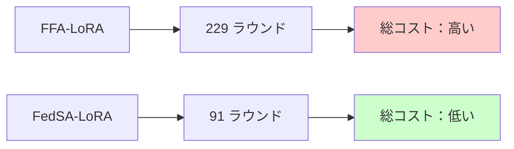

#### 🚀 迅速な収束の利点

結果として：
- **総通信コスト** = 通信ラウンド数 × 1ラウンドあたりのペイロード
- FedSA-LoRAは1ラウンドあたりのコストがわずかに高くても、必要なラウンド数が大幅に少ない
- **目標精度を達成するための総通信コストと総時間がはるかに効率的**

この迅速な収束は、実世界のアプリケーションにおいて、**リソース使用量と展開時間を削減する上で決定的な利点**となります。

### 4.3 比較フレームワーク

提案手法の優位性を明確にするため、主要な連合学習戦略を複数の重要な軸で比較します：

| 特徴 / 手法 | FedAvg<br>(フルモデル) | Federated LoRA<br>(標準) | FFA-LoRA | **提案ハイブリッド**<br>(FbFTL + FedSA-LoRA) |
|-------------|------------------------|---------------------------|-----------|----------------------------------------------|
| **学習対象パラメータ** | 全モデルパラメータ | ヘッド部のLoRAパラメータ<br>(A & B) | ヘッド部のLoRA<br>B 行列のみ | ヘッド部のLoRAパラメータ<br>(A & B) |
| **1ラウンドあたりのペイロード** | 🔴 非常に高い<br>(全パラメータ) | 🟡 低い<br>(A & B 行列) | 🟢 非常に低い<br>(B 行列のみ) | 🟢 **極めて低い**<br>(A 行列のみ) |
| **non-IIDデータへの堅牢性** | 🔴 低い<br>(モデル発散のリスク) | 🟡 中程度<br>(集約エラー) | 🟡 中程度<br>(適応能力に制限) | 🟢 **高い**<br>(ローカルB行列によるパーソナライズ) |
| **パーソナライゼーション** | 🔴 なし<br>(単一グローバルモデル) | 🟡 部分的<br>(ローカルでの微調整経由) | 🟡 限定的<br>(A行列が固定) | 🟢 **アーキテクチャに内蔵**<br>(ローカルB行列) |
| **総合効率**<br>(目標精度到達まで) | 🔴 非常に低い<br>(多ラウンド、高ペイロード) | 🟡 中程度 | 🟡 良好<br>(低ペイロードだが収束は遅い) | 🟢 **非常に高い**<br>(最少ラウンド、最低ペイロード) |
| **計算の所在** | クライアント: 完全な順/逆伝播 | クライアント: ヘッド部で完全な順/逆伝播 | クライアント: ヘッド部で完全な順/逆伝播 | クライアント: f₁で順伝播、ヘッド部で順/逆伝播<br>サーバー: 集約 |

#### 🏆 **総合評価**

この表は、提案手法が特に以下の面で他の手法を**一貫して凌駕**していることを示しています：

- ✅ **ペイロード効率**：極めて低い通信コスト
- ✅ **non-IIDデータ堅牢性**：高い異質性耐性
- ✅ **総合効率**：最速の目標精度到達

各手法が持つトレードオフの中で、提案ハイブリッド手法が**最も望ましい特性の組み合わせ**を実現していることがわかります。

### 4.4 ネイティブFbFTLに対するスケーラビリティとプライバシーの優位性

セクション2.1で指摘したネイティブFbFTLの潜在的課題は、本ハイブリッド手法によって効果的に解決されます。

#### 🔧 スケーラビリティの解決

**課題**：
```
タスク特化ヘッドの中央集権的な学習
↓
サーバーが膨大な特徴データセットを保存・処理
↓
スケーラビリティのボトルネック
```

**解決**：
```
FedSA-LoRAプロトコルによる連合学習への置き換え
↓
サーバーは軽量なA行列のみを処理
↓
クライアント数に対するスケーラビリティが劇的に向上
```

#### 🔒 プライバシーの強化

**従来のFbFTL**：
```
クライアント → サーバー: 特徴ベクトル z
リスク: 機密情報を含む可能性
```

**本ハイブリッド手法**：
```
クライアント → サーバー: 集約されたA行列のみ
利点: 個別のデータは一切観測不可
```

#### 🛡️ プライバシー保護の強化

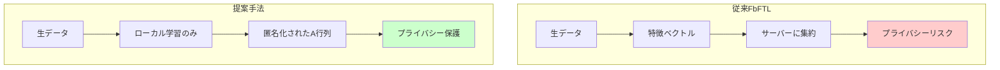

**本質的により高いプライバシー保護**：
- ✅ サーバーはクライアント固有のデータを一切受信しない
- ✅ 生データはもちろん、特徴ベクトル z さえも送信されない
- ✅ サーバーが観測できるのは複数のクライアントから集約され、匿名化されたグローバルな知識（A 行列）のみ
- ✅ データがサーバーに集中するリスクを排除
- ✅ 連合学習の核となるプライバシー保護の原則をより忠実に遵守

---## 5. 広範な影響と将来性

提案するフレームワークは、特定の条件下でのみ有効な一時的な解決策ではなく、将来の技術的進展にも対応可能な、**一般性と堅牢性を備えたパラダイム**です。

### 5.1 一般化可能なパラダイム

#### 🔬 非対称性の一般性

研究では、LoRAにおける A 行列と B 行列の役割の非対称性が、以下の他のLoRA派生手法においても**一貫して観察される**ことが示されています：

- **rsLoRA** - Rank-Stabilized LoRA
- **VeRA** - Vector-based Random Matrix Adaptation
- その他のLoRAファミリー手法

#### 💡 FedSAの基本原則

```
普遍的な知識（A）を共有 + 個別的な知識（B）をローカルに保つ
```

この考え方が、**特定のアルゴリズムに限定されない、より広範な一般性**を持つことを意味します。

#### 🚀 Future-Proof設計

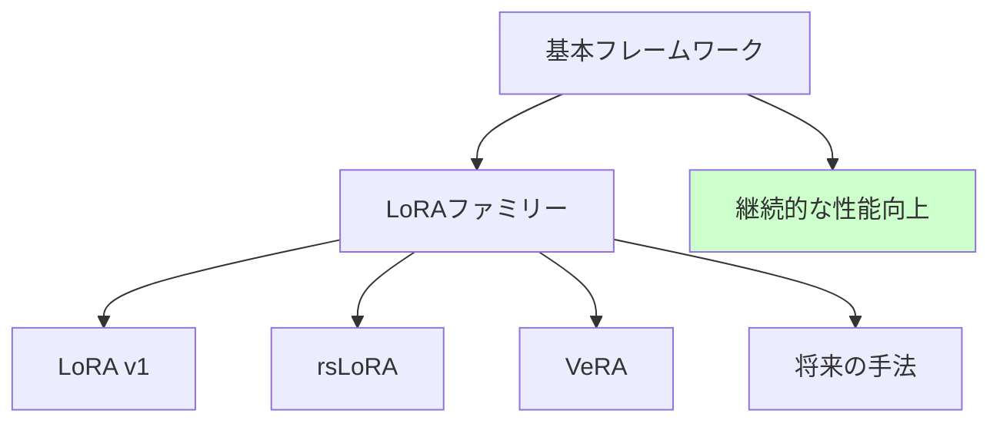

**重要な影響**：
- ✅ 提案するハイブリッドフレームワークは、特定のLoRA実装に縛られない
- ✅ 将来、より効率的で高性能なLoRAファミリーの手法が開発された場合、容易に組み込み可能
- ✅ アーキテクチャの基本設計を変更することなく、継続的な性能向上が可能
- ✅ 本フレームワークは「**将来性を保証された（future-proof）**」ものとなる

### 5.2 堅牢性と多様性

#### 📊 多様な条件での安定性能

FedSA-LoRAの核となる適応メカニズムは、**多様な条件下で安定した性能を発揮する堅牢性**を備えています。

実験結果による証明：

| 変動要素 | 範囲 | 性能 |
|----------|------|------|
| **クライアント数** | 10 〜 100クライアント | ✅ 一貫して他手法を上回る |
| **LoRAランク** | r ∈ {2, 4, 8, 16} | ✅ 全範囲で安定した優位性 |
| **データ異質性** | 様々なnon-IID度合い | ✅ 高い適応性を維持 |

#### 🌐 実世界への適応性

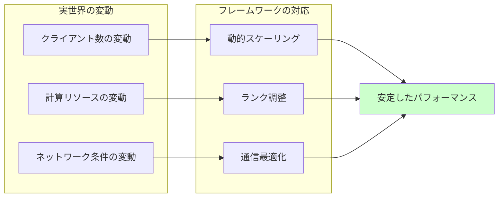

この堅牢性と柔軟性は、そのまま本ハイブリッドフレームワークに継承されます。

**実用性への影響**：
- 🏢 企業環境での動的なクライアント参加・離脱
- 📱 モバイルデバイスのリソース変動
- 🌐 ネットワーク環境の多様性
- 🔧 運用条件の動的変化

これらすべてに対して**安定して高いパフォーマンスを維持**できる能力は、本フレームワークの実用性を大きく高めます。

---

## 6. 結論と戦略的意義

### 6.1 多角的ソリューションの要約

本レポートで提案したハイブリッドフレームワークの優位性は、単一の機能によるものではなく、**複数のアーキテクチャ的およびアルゴリズム的革新を知的に統合した結果**です。

#### 🎯 二つの主要課題に対する体系的解決

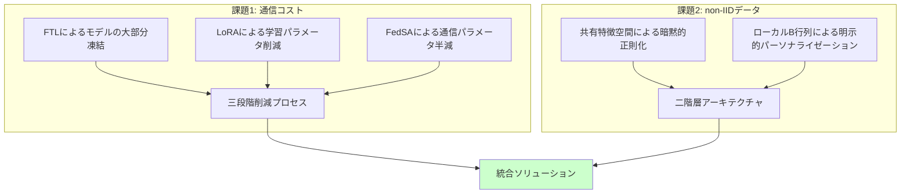

#### 📈 段階的削減効果

**通信コストの問題**：
1. **FTL** → モデルの大部分を凍結
2. **LoRA** → 学習パラメータを削減  
3. **FedSA** → 通信パラメータを半減

**non-IIDデータの問題**：
1. **共有特徴空間** → 暗黙的な正則化
2. **ローカルB行列** → 明示的なパーソナライゼーション

> **重要**：本手法は複数の課題を**同時に、かつ相乗的に解決**する洗練された設計となっています。

### 6.2 戦略的価値

#### 🌟 次世代連合AIの基盤技術

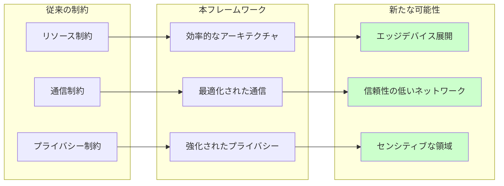

提案するフレームワークは、**次世代の連合AIを実現するための重要な基盤技術**として位置づけられます。

#### 🎯 実用的な価値提案

**対象組織**：
- 大規模な基盤モデルを展開したい組織
- リソースに制約のあるエッジデバイスを活用したい企業
- 信頼性の低いネットワーク環境で運用する必要がある組織  
- プライバシーに敏感な領域でAIを活用したいセクター

**提供価値**：
```
実用的で強力な道筋 = 高効率 + 高性能 + 高プライバシー
```

#### 🚀 適用範囲の拡大

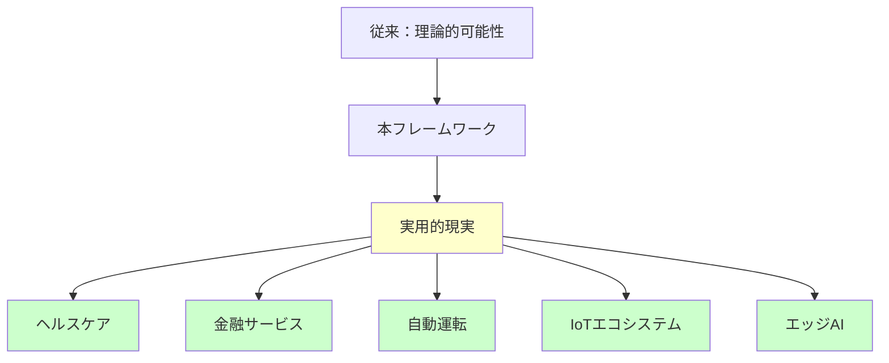

これまで**通信コストやデータの異質性といった障壁によって非現実的**とされてきた多くのアプリケーションシナリオが、このフレームワークによって**実現可能**となります。

#### 🏆 戦略的意義

> **結論**：本手法は、連合学習の適用範囲を大幅に拡大し、**分散型インテリジェンスの新たな時代を切り開く可能性**を秘めた、戦略的に極めて価値の高い技術であると言えます。

---

## 📚 参考文献・注釈

本文書は、FbFTL（Feature-based Federated Transfer Learning）とFedSA-LoRA（Federated Share-A Low-Rank Adaptation）に関する研究論文を基に作成されており、具体的な実験データと理論的分析に基づいて議論を展開しています。

---

*最終更新：2025年9月16日*